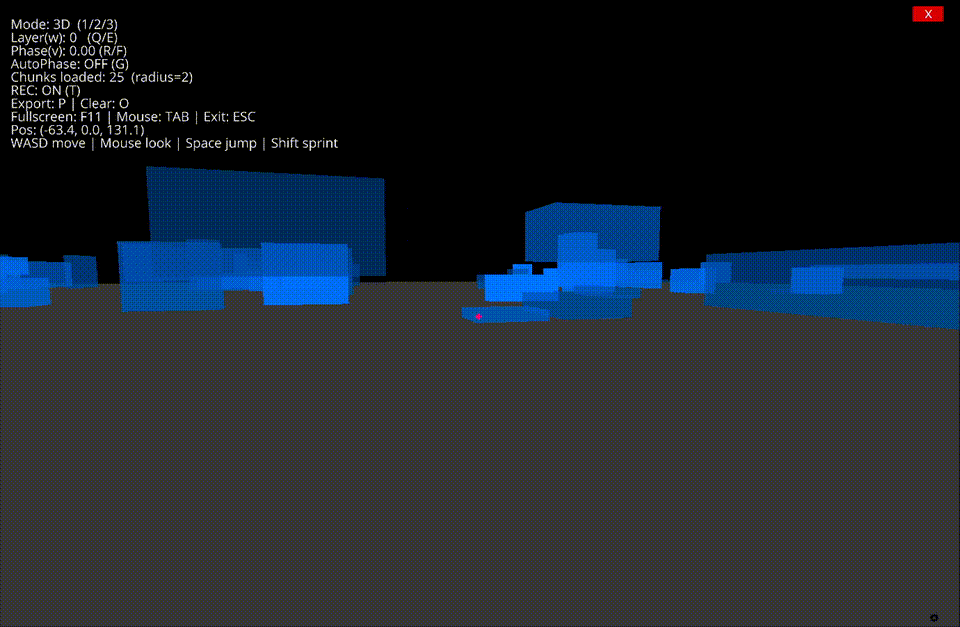

# Geomancer_FPV

A **Python + Ursina** first‑person exploration prototype that maps “higher‑dimensional coordinates” into an interactive world:
- **w = Layer** (discrete parallel worlds)
- **v = Phase** (continuous world state)

The project focuses on being a clean, runnable **prototype** you can demo, record, and cite on a CV.

---

## Demo



- `assets/demo.gif`

---

## Features

- **FPS controls**: mouse look + WASD + jump + sprint
- **Infinite world (chunk streaming)**: dynamically loads/unloads chunks around the player
- **Parallel‑world parameters**
  - `Layer (w)`: switching layers changes world generation (chunk seeds depend on `layer`)
  - `Phase (v)`: in 5D mode, applies a subtle “breathing drift” to obstacles
- **Portals**: randomly spawn in some chunks; approaching a portal triggers `Layer + 1`
- **Trajectory export**: export `trajectory.json` (pos/rot/mode/layer/phase)

---

## Install

Recommended: use a virtual environment.

```bash
python -m venv .venv
source .venv/bin/activate      # macOS / Linux
# .venv\Scripts\activate     # Windows PowerShell
pip install -r requirements.txt
```

Run:

```bash
python main.py
```

---

## Controls

### Movement
- **W/A/S/D**: move
- **Mouse**: look
- **Space**: jump
- **Shift**: sprint

### Modes (dimension labels)
- **1** → **3D** (locks `Layer=0, Phase=0`)
- **2** → **4D** (unlocks `Layer`: Q/E)
- **3** → **5D** (unlocks `Layer + Phase`: Q/E + R/F)

### Layer / Phase
- **Q / E** → Layer -/+ (4D/5D only)
- **R / F** → Phase -/+ (5D only)
- **G** → AutoPhase toggle (5D only)

### Recording
- **T** → toggle trajectory recording
- **P** → export `trajectory.json`
- **O** → clear in‑memory trajectory

### Window / Input (macOS friendly)
- **TAB** → toggle mouse lock (release cursor back to OS)
- **F11** → toggle fullscreen
- **ESC** → quit

---

## What “Dimensions” Mean in This Prototype

In the current version, “dimension” is primarily a **control/parameter unlock**:

- **3D**: fixed world (`Layer=0`, `Phase=0`)
- **4D**: you can switch **parallel worlds** by changing `Layer`
- **5D**: you can additionally adjust `Phase`, which currently produces a subtle obstacle drift

> In other words: it mostly affects **world generation / world state**, not player abilities (yet).

---

## Repository Layout

```text
Geomancer_FPV/
  main.py
  requirements.txt
  README.md
  LICENSE
  .gitignore
  assets/
    demo.gif            # optional
```

---

## Future Work

### 1) Make Higher Dimensions “Feel Physical”
- **4D w‑slicing / phasing**: allow temporary “bypass” of certain barriers (as if moving along the w axis)
- **5D phase affects player physics**: tie phase to gravity / speed / jump height so 5D is immediately tangible
- **Phase‑based topology switching**: phase interpolates between two layouts (opening/closing paths)

### 2) World Generation Quality
- **Noise heightmap terrain**: per‑chunk hills/valleys (not flat tiles)
- **Voxel‑style blocks / materials**: trees, rocks, ores, structures
- **Biomes by Layer**: each layer has a distinct generation style

### 3) UX / Debug Tools
- **Minimap / compass**: chunk coordinates, heading, “return home” pointer
- **Portal tracking**: nearest portal direction & distance
- **Config system**: move constants into a config file / CLI args

### 4) Data & RL Integration
- **Trajectory schema versioning**: add `schema_version` to exported JSON
- **Dataset export**: episode slicing + compression (e.g., parquet)
- **Gym‑like wrapper**: expose the world as an RL environment

---

## License

MIT — see `LICENSE`.
